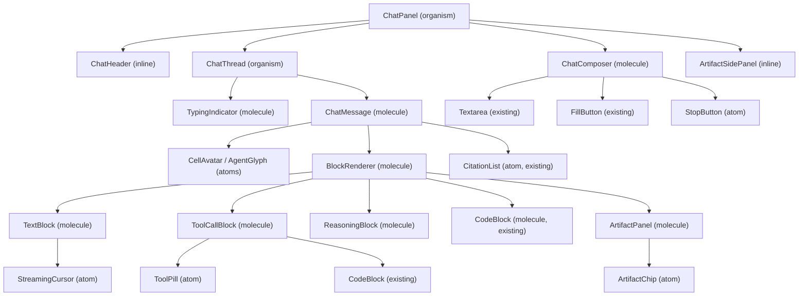

# Agentic AI Chat Interface — Design Spec

Date: 2026-07-07
Status: Approved
Package: `@balaur/ui` (`packages/ui/src/{atoms,molecules,organisms}`)

## Goal

Build a complete, reusable **agentic AI chat interface** as OCTANT design-system
components — atoms, molecules, and organisms — with Storybook stories. The
interface surfaces tool calls, reasoning, token streaming, multi-step plans,
multiple named agents, inline citations, and artifacts. All components are
controlled (props-driven) and transport-agnostic; the consuming app owns stream
subscription and message state.

## Decisions (from brainstorming)

| Decision | Choice |
|---|---|
| Target home | `design/packages/ui`, reusable components + Storybook stories |
| Component style | Controlled, props-driven, OCTANT convention (one component per folder) |
| Agent behaviors surfaced | Tool calls, reasoning, streaming, multi-step plan, multi-agent, citations, artifacts |
| Message content model | Structured block list (`Block[]`, discriminated union) |
| Text rendering | Plain text + minimal inline formatting (line breaks, `code`, **bold**, links); no markdown dependency |
| Streaming model | Purely presentational; app owns state. OCTANT provides animation hooks only. |
| Architecture | Dispatcher (`BlockRenderer`) + per-block molecules |

## Non-goals

- No markdown library or full markdown parser.
- No transport/network layer, no provider SDK, no stream subscription logic.
- No persistent conversation storage or routing.
- No changes to `web/` in this spec (components are reusable; `web/` consumes later).

## Type model

Lives in `packages/ui/src/organisms/ChatPanel/chat-types.ts` and is re-exported
from the root barrel (`@balaur/ui`).

```ts
export type BlockStatus = "running" | "done" | "error";

export type Block =
  | { type: "text"; text: string; streaming?: boolean }
  | { type: "reasoning"; text: string; defaultCollapsed?: boolean }
  | {
      type: "tool_call";
      id: string;
      name: string;
      args?: unknown;
      result?: unknown;
      status: BlockStatus;
      startedAt?: number;
      endedAt?: number;
    }
  | { type: "code"; language?: string; code: string }
  | {
      type: "artifact";
      id: string;
      title: string;
      kind: "code" | "document" | "image";
      language?: string;
      content: string;
    }
  | { type: "citations"; sources: CitationSource[] };

export interface ChatMessageData {
  id: string;
  role: "user" | "agent" | "system" | "tool";
  /** For multi-agent threads: which agent produced this message. */
  agentId?: string;
  name?: string;
  time?: string;
  blocks: Block[];
  status?: "streaming" | "complete" | "error";
}

export interface Agent {
  id: string;
  name: string;
  /** Accent CSS color or token; overrides AgentGlyph's hashed accent. */
  accent?: string;
  /** Override the quadrant mosaic glyph. */
  glyph?: string;
}

/** One step in an AgentPlan. */
export interface PlanStep {
  id: string;
  label: string;
  status: "pending" | "running" | "done" | "error";
  /** Optional detail line shown under the label when running/expanded. */
  detail?: string;
}
```

`CitationSource` is the existing type from `atoms/InlineCitation/InlineCitation`.

## Component inventory

### New atoms (5)

All single-purpose; compose no other custom component.

| Folder | Component | Purpose | Key props |
|---|---|---|---|
| `atoms/StreamingCursor/` | `StreamingCursor` | Blinking terminal cursor block appended to streaming text. Uses the global `bx-blink` keyframe. Reduced-motion: steady. | `active?: boolean` |
| `atoms/ToolPill/` | `ToolPill` | `▸ tool_name` chip with a status glyph: `·` idle, `◐` running (spin via BrailleSpinner-style rAF), `✓` done, `✕` error. | `name: string; status: BlockStatus \| "idle"` |
| `atoms/AgentGlyph/` | `AgentGlyph` | Name-hashed quadrant mosaic + accent — a distinct sigil per named agent (multi-agent). Hashes `agent.id` → one of the 16 ANSI palette hues + a 2×2 octant mosaic. Opts into the accent recolour system. | `agent: Agent; size?: number` |
| `atoms/ArtifactChip/` | `ArtifactChip` | Artifact type icon (`{ }` code, `¶` document, `▦` image) + title chip, clickable. | `kind: "code" \| "document" \| "image"; title: string; onClick?: () => void` |
| `atoms/StopButton/` | `StopButton` | Square-stop variant of FillButton for cancelling generation. Renders `■`. | `onClick?: () => void; disabled?: boolean` |

### New molecules (8)

Compose atoms and existing components.

| Folder | Component | Purpose | Composes |
|---|---|---|---|
| `molecules/ChatMessage/` | `ChatMessage` | One message row: avatar (CellAvatar or AgentGlyph by role/agentId) + name + time + `blocks.map(BlockRenderer)` + optional `CitationList` footer. Agent messages accent-tinted and left-aligned; user right-aligned; system centered/dimmed; tool left-aligned with tool avatar. | CellAvatar, AgentGlyph, BlockRenderer, CitationList |
| `molecules/BlockRenderer/` | `BlockRenderer` | Dispatches a `Block` to the right block molecule by `type`. The single switch point so ChatMessage stays thin. | TextBlock, ToolCallBlock, ReasoningBlock, CodeBlock, ArtifactPanel, CitationList |
| `molecules/TextBlock/` | `TextBlock` | Renders a text block with minimal inline formatting: line breaks, `` `code` ``, `**bold**`, and bare URLs as links. Appends `StreamingCursor` when `streaming`. No markdown dependency — a tiny inline tokenizer. | StreamingCursor |
| `molecules/ToolCallBlock/` | `ToolCallBlock` | Collapsible tool call: `ToolPill` header (click to expand/collapse) + args as `CodeBlock` (JSON) + result as `CodeBlock` (JSON, error-coloured on `status: "error"`) + timing line (`123ms`). Collapsed by default once `status === "done"`. | ToolPill, CodeBlock |
| `molecules/ReasoningBlock/` | `ReasoningBlock` | Collapsible "THINKING" trace: a `▸` chevron + dim label + dimmed text. Collapsed by default (`defaultCollapsed`). Expands to show the reasoning text via `TextBlock`. | TextBlock (for the expanded text) |
| `molecules/ArtifactPanel/` | `ArtifactPanel` | Artifact card: header (`ArtifactChip` + open `↗` action) + preview body (`CodeBlock` for code, preformatted text for document, glyph placeholder for image). | ArtifactChip, CodeBlock |
| `molecules/ChatComposer/` | `ChatComposer` | Input area: `Textarea` + Send (`FillButton`) / Stop (`StopButton`) toggle by `streaming` + optional attach hint (`📎` glyph + label) + slash-command hint (`/` kbd). Enter sends, Shift+Enter newline. Disabled while `streaming` (except Stop). | Textarea, FillButton, StopButton |
| `molecules/TypingIndicator/` | `TypingIndicator` | Agent-thinking row: `BrailleSpinner` + `"thinking…"` + animated dots. Shown at the bottom of `ChatThread` while `streaming` and the last agent message has no text yet. | BrailleSpinner |

### New organisms (3)

Complex, stateful compositions.

| Folder | Component | Purpose | Key props |
|---|---|---|---|
| `organisms/ChatThread/` | `ChatThread` | Scrollable message list. Renders `ChatMessage` rows. Auto-follows the bottom when new content arrives (a `useFollowBottom`-style internal hook, paused when the user scrolls up — shows a "↓ jump to latest" affordance). Appends `TypingIndicator` while `streaming`. | `messages: ChatMessageData[]; agents?: Agent[]; streaming?: boolean` |
| `organisms/AgentPlan/` | `AgentPlan` | Multi-step plan: ordered `PlanStep[]` with `pending`/`running`/`done`/`error` states. Current step highlighted with an accent rail and a BrailleSpinner. Completed steps show `✓` and collapse to one line. Clickable steps (`onStepClick`). | `steps: PlanStep[]; onStepClick?: (id: string) => void` where `PlanStep = { id; label; status: BlockStatus \| "pending"; detail?: string }` |
| `organisms/ChatPanel/` | `ChatPanel` | The top-level surface. Header (agent name + `PresenceStatus` + actions) + `ChatThread` + `ChatComposer` + optional `ArtifactSidePanel` (a tabbed list of `ArtifactPanel`s when `artifacts` is non-empty). Owns only UI state (composer value, scroll-follow); calls `onSend`/`onStop`/`onArtifactOpen`. | `messages; agents?; streaming?; artifacts?; composerValue?; defaultComposerValue?; onComposerValueChange?; onSend: (text: string) => void; onStop?: () => void; onArtifactOpen?: (id: string) => void` |

`ChatPanel` re-exports the shared types (`Block`, `ChatMessageData`, `Agent`, `PlanStep`).

### Reused existing components (no changes)

`CellAvatar` (+ `CellAvatarRow`), `PresenceStatus`, `InlineCitation` /
`CitationSource` / `CitationList`, `CodeBlock`, `BrailleSpinner`, `Textarea`,
`FillButton`, `Tag`, `Badge`, `Avatar`; hooks `useTypewriter`, `useScramble`,
`useControllableState`, `useReducedMotion`.

## Composition



`ChatHeader` and `ArtifactSidePanel` are inline subcomponents inside `ChatPanel/`
(not separate folders) — they have no standalone reuse and would just be clutter.

## Data flow

1. The app holds `messages: ChatMessageData[]`, `streaming: boolean`, `composerValue`, optional `agents` and `artifacts`.
2. As stream tokens arrive, the app appends to the last `text` block's `text` and sets that block's `streaming: true`; on completion it sets `streaming: false` and `message.status = "complete"`.
3. The app passes the updated `messages` + `streaming` to `ChatPanel`.
4. `ChatPanel` forwards to `ChatThread`, which renders rows and auto-scrolls.
5. `ChatComposer` calls `onSend(text)` on Enter; the app sends and flips `streaming`. While `streaming`, the composer shows `StopButton` → `onStop`.
6. Tool calls, reasoning, code, artifacts, and citations appear as blocks in the message — each rendered by its dedicated molecule via `BlockRenderer`.

## Stories

Each new component gets a `.stories.tsx` under
`OCTANT/<Atoms|Molecules|Organisms>/<Name>`:

- **Atoms**: each gets Default + variant stories (e.g. `ToolPill` → Running/Done/Error/Idle).
- **Molecules**: realistic fixtures — a `ChatMessage` per role (user/agent/system/tool); a `ToolCallBlock` in each status; a `ReasoningBlock` collapsed/expanded; an `ArtifactPanel` per kind; a `ChatComposer` idle/streaming; a `TypingIndicator`.
- **Organisms**: a `ChatThread` with a multi-turn fixture (user → agent reasoning → tool call → tool result → agent text with citations); a streaming state; a multi-agent thread (two named agents, distinct `AgentGlyph`s). An `AgentPlan` mid-execution (3 done, 1 running, 2 pending). A full `ChatPanel` with header, thread, composer, and an artifact side panel.

## Error handling

- `tool_call` with `status: "error"` → `ToolPill` shows `✕` in red (`--bx-ansi-9`), result block red-tinted.
- `ChatMessage` with `status: "error"` → a red hairline border + an `ERR` badge in the header.
- Unknown `block.type` → `BlockRenderer` renders a dim `unknown block: <type>` placeholder (defensive; never throws).
- Empty `messages` → `ChatThread` renders an `EmptyState` (existing molecule) with a "start a conversation" prompt.

## Testing

- `@balaur/octant-core`-style unit tests where pure logic exists: `AgentGlyph` hash → mosaic determinism; `TextBlock` inline tokenizer (bold/code/link extraction).
- Component behaviour is otherwise covered by Storybook stories (visual + a11y), matching the existing OCTANT convention (most components are story-tested, not unit-tested).
- `bun run check` must pass in `design/`.

## Verification plan

1. `bun run check` (typecheck + lint + test) in `design/` — green.
2. `bun run storybook` — every new story renders under the correct `OCTANT/<Category>/<Name>` path; no console errors.
3. Cross-repo: `bun run check` in `web/` — still compiles (no consumption yet, so expected unchanged).

## File layout (new files only)

```
packages/ui/src/
  atoms/
    StreamingCursor/StreamingCursor.tsx + .stories.tsx
    ToolPill/ToolPill.tsx + .stories.tsx
    AgentGlyph/AgentGlyph.tsx + .stories.tsx
    ArtifactChip/ArtifactChip.tsx + .stories.tsx
    StopButton/StopButton.tsx + .stories.tsx
  molecules/
    ChatMessage/ChatMessage.tsx + .stories.tsx
    BlockRenderer/BlockRenderer.tsx + .stories.tsx
    TextBlock/TextBlock.tsx + .stories.tsx + text-block.test.ts
    ToolCallBlock/ToolCallBlock.tsx + .stories.tsx
    ReasoningBlock/ReasoningBlock.tsx + .stories.tsx
    ArtifactPanel/ArtifactPanel.tsx + .stories.tsx
    ChatComposer/ChatComposer.tsx + .stories.tsx
    TypingIndicator/TypingIndicator.tsx + .stories.tsx
  organisms/
    ChatThread/ChatThread.tsx + .stories.tsx
    AgentPlan/AgentPlan.tsx + .stories.tsx
    ChatPanel/ChatPanel.tsx + .stories.tsx + chat-types.ts
```

Each category's `index.ts` barrel gets the new `export *` lines appended; the
root `src/index.ts` already re-exports the category barrels, so the public API
updates automatically.
